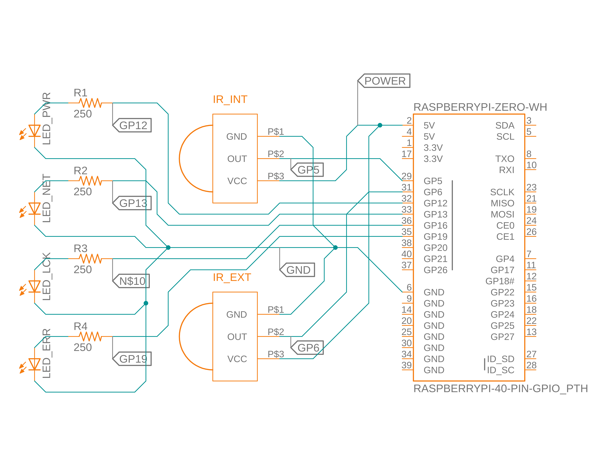
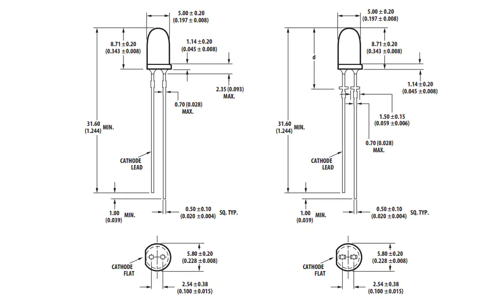
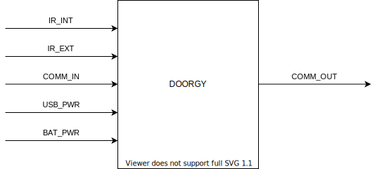
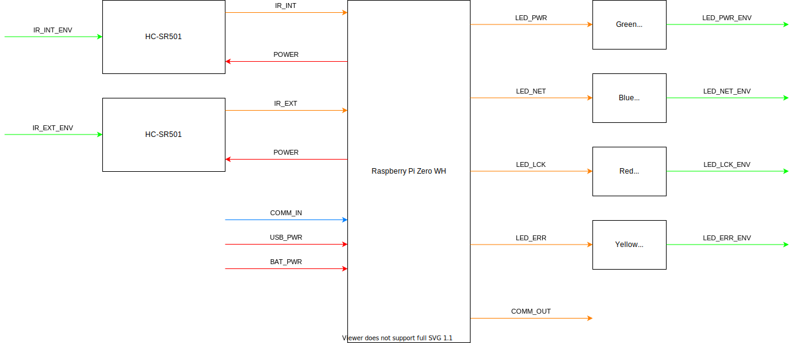

# ECE 342 Pet Door Project - Doorgy

Doorgy - Smart Pet Door for your home, connected right to your phone. Hidden suprise included.

Created by Anthony Kung <hi@anth.dev> (https://anth.dev)

## Contents

- [ECE 342 Pet Door Project - Doorgy](#ece-342-pet-door-project---doorgy)
  - [Contents](#contents)
  - [Overview](#overview)
  - [Schematic](#schematic)
  - [Mechanical Drawing](#mechanical-drawing)
    - [Raspberry Pi Zero](#raspberry-pi-zero)
    - [HC-SR501](#hc-sr501)
    - [5mm LED](#5mm-led)
  - [Code](#code)
  - [Block Diagrams](#block-diagrams)
    - [Black Box Diagram](#black-box-diagram)
    - [Block Diagram](#block-diagram)
  - [Interface Definition](#interface-definition)
  - [Bill of Material](#bill-of-material)

## Overview

This portion of the project includes IR motion sensors and 5mm LEDs.

The IR sensors (HC-SR501) is used to detect pet movements from inside and outside the door. The IR sensor will be used to send control signal to a single board computer (Raspberry Pi Zero WH) to be processed and activate the servo motors to open the door.

The 5mm LEDs are used to indicate the condition of the system. A green LED indicate the system is operating with sufficient power. A blue LED is used to indicate network connectivity. A red LED is used to indicate if the door has been locked. And a yellow LED is used to report errors. A 5mm LED has a current rating of 20mA, to protect the LED from the Raspberry Pi 5V voltage supply, a 250Ω resistor is require for each of them. This value is calculated by the formula ***V = IR*** where the resistor value can be found by dividing the voltage (5V) by the current (20mA) which gives 250Ω.

## Schematic



## Mechanical Drawing

### Raspberry Pi Zero


### HC-SR501


### 5mm LED



## Code

```javascript
/****************************************
 *                                      *
 * Name: doorgy.js                      *
 * Description: Doorgy - Smart Pet Door *
 * Date: April 16, 2021                 *
 * Created by: Anthony Kung             *
 * Author URL: https://anth.dev         *
 * License: Apache-2.0 (See LICENSE.md) *
 *                                      *
 ****************************************/

// Include Packages
const GPIO = require('onoff').Gpio;
const DNS = require('dns');
const FS = require('fs');

// Define Global Constant
const server = 'doorgy.anth.dev';

// Define Global Variable
let ctrlSig = 1;

// Check Status
if (GPIO.accessible) {
  // Define IR GPIO
  var IR_INT = new GPIO(5, 'in', 'both');
  var IR_EXT = new GPIO(6, 'in', 'both');

  // Define LED GPIO
  var LED_PWR = new GPIO(12, 'out');
  var LED_NET = new GPIO(13, 'out');
  var LED_LCK = new GPIO(16, 'out');
  var LED_ERR = new GPIO(19, 'out');

  // var in JS has global scope

  // Turn on power indicator
  LED_PWR.writeSync(1);
} else {
  // If error occured turn on Error indicator
  LED_ERR.writeSync(1);
}

// Define Interial IR Function
IR_INT.watch((err, value) => {
  if (err) {
    throw err;
  }
  else if (value) {
    // Inform Servo Unit montion is detected
  }
  else {
    // Inform Servo Unit no motion is detected
  }
});

// Define Interial IR Function
IR_EXT.watch((err, value) => {
  if (err) {
    throw err;
  }
  else if (value) {
    // Inform Servo Unit montion is detected
  }
  else {
    // Inform Servo Unit no motion is detected
  }
});

// Free Resources If Termination Requested
process.on('SIGINT', _ => {
  IR_INT.unexport();
  IR_EXT.unexport();
  LED_PWR.unexport();
  LED_NET.unexport();
  LED_LCK.unexport();
  LED_ERR.unexport();
});

// Listern for Locking Mechnism
// Child Process Method
process.on('message', message => {
  let comm = JSON.parse(message);
  if (comm.Lock.status == 1) {
    // Turn on Lock indicator
    LED_LCK.writeSync(1);
  }
  else {
    // Turn off Lock indicator
    LED_LCK.writeSync(0);
  }
});

// Listern for Locking Mechnism
// Read File Method
while (ctrlSig) {
  fs.readFile('doorgy.json', function(err, data) {
    let comm = JSON.parse(data);
    if (comm.Lock.status == 1) {
      // Turn on Lock indicator
      LED_LCK.writeSync(1);
    }
    else {
      // Turn off Lock indicator
      LED_LCK.writeSync(0);
    }
  });
}

// Begin Continuous Operation
while (ctrlSig) {

  // Check For Network Connection
  DNS.resolve(server, function(err) {
    if (err) {
      // Turn off Network indicator
      LED_NET.writeSync(0);

      // Note: Doorgy is designed to operate even when network
      // connection has been disconnected, so there is no need
      // to turn on Error indicator
    } else {
      // Turn on Network indicator if connection to server
      // is established
      LED_NET.writeSync(1);
    }
  });
}

```

## Block Diagrams

### Black Box Diagram


### Block Diagram


## Interface Definition

| Name | Type | Definition |
| ---- | ---- | ---------- |
| BAT_PWR | DC Power | <ul><li>Voltage: 5.1V</li><li>Current: 1.2A</li></ul> |
| USB_PWR | DC Power | <ul><li>Voltage: 5.1V</li><li>Current: 1.2A</li></ul> |
| POWER | DC Power | <ul><li>Voltage: 5.0V</li><li>Current: 1.2A</li></ul> |
| IR_INT | Analog Signal | <ul><li>Voltage: DC 5V</li><li>Minimium Range: 1m</li></ul> |
| IR_EXT | Analog Signal | <ul><li>Voltage: DC 5V</li><li>Minimium Range: 1m</li></ul> |
| COMM_IN | Data | Format: JSON Object |
| COMM_OUT | Data | Format: JSON Object |
| LED_PWR | Analog Signal | <ul><li>Voltage: 5.0V</li><li>Current: 20mA</li></ul> |
| LED_NET | Analog Signal | <ul><li>Voltage: 5.0V</li><li>Current: 20mA</li></ul> |
| LED_LCK | Analog Signal | <ul><li>Voltage: 5.0V</li><li>Current: 20mA</li></ul> |
| LED_ERR | Analog Signal | <ul><li>Voltage: 5.0V</li><li>Current: 20mA</li></ul> |

## Bill of Material


