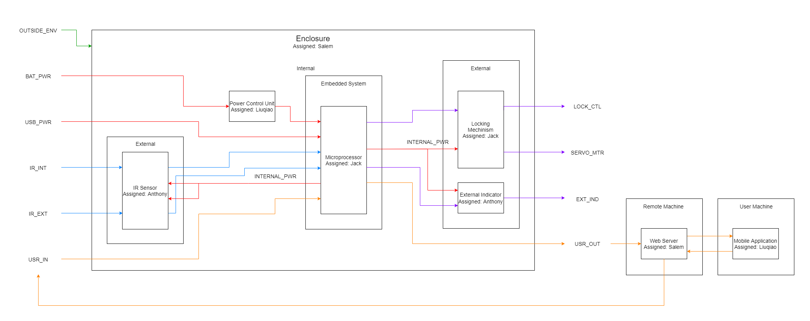
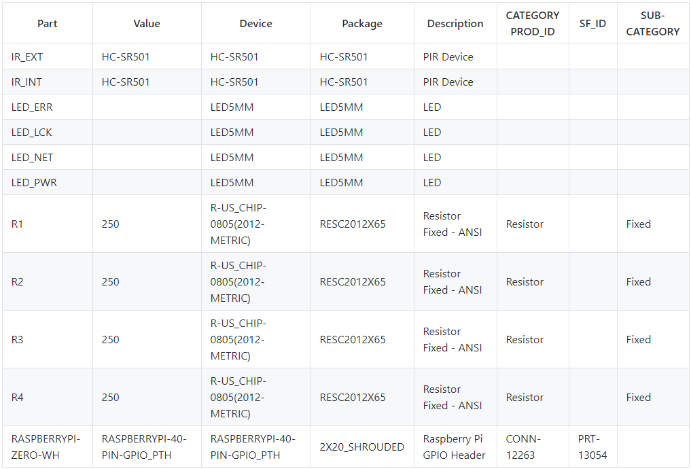

# ECE 342 Pet Door Project - Doorgy

Doorgy - Smart Pet Door for your home, connected right to your phone. Hidden surprise included.

Created by Anthony Kung <hi@anth.dev> (https://anth.dev)

## Contents

- [ECE 342 Pet Door Project - Doorgy](#ece-342-pet-door-project---doorgy)
  - [Contents](#contents)
  - [Overview](#overview)
  - [Schematic](#schematic)
  - [Mechanical Drawing](#mechanical-drawing)
    - [Raspberry Pi Zero](#raspberry-pi-zero)
    - [HC-SR501](#hc-sr501)
    - [5mm LED](#5mm-led)
  - [Code](#code)
    - [Structure](#structure)
      - [Entire Service Package](#entire-service-package)
      - [Service File](#service-file)
    - [Primary Program Executable](#primary-program-executable)
    - [Installer](#installer)
    - [Service Scheduler](#service-scheduler)
  - [Block Diagrams](#block-diagrams)
    - [Overall System](#overall-system)
    - [Black Box Diagram](#black-box-diagram)
    - [Block Diagram](#block-diagram)
  - [Interface Definition](#interface-definition)
  - [Bill of Material](#bill-of-material)

## Overview

This portion of the project includes IR motion sensors and 5mm LEDs.

The IR sensors (HC-SR501) are used to detect pet movements from inside and outside the door. The IR sensor will be used to send the control signal to a single board computer (Raspberry Pi Zero WH) to be processed and activate the servo motors to open the door.

The 5mm LEDs are used to indicate the condition of the system. A green LED indicates the system is operating with sufficient power. A blue LED is used to indicate network connectivity. A red LED is used to indicate if the door has been locked. And a yellow LED is used to report errors. A 5mm LED has a current rating of 20mA, to protect the LED from the Raspberry Pi 5V voltage supply, a 250Ω resistor is required for each of them. This value is calculated by the formula ***V = IR*** where the resistor value can be found by dividing the voltage (5V) by the current (20mA) which gives 250Ω.

## Schematic


## Mechanical Drawing

### Raspberry Pi Zero


### HC-SR501


### 5mm LED


## Code

### Structure

#### Entire Service Package

```
/usr/local/src/
├── README.md
├── doorgy.js
├── package.json
└── resources/
    ├── installer.js
    ├── doorgy.service
    ├── doorgy-init.sh
    └── anthonian.js
```

#### Service File

```
/etc/systemd/services/
└── doorgy.service
```

### Primary Program Executable

```javascript
/**
 *
 * @description Doorgy - Smart Pet Door.
 * @file        doorgy.js
 * @link        https://doorgy.anth.dev
 * @license     Apache-2.0
 * @author      Anthony Kung <hi@anth.dev>
 * @since       1.0.0
 * @version     1.2.8
 *
 */

// Include Packages
const gpio = require('onoff').Gpio;
const fs = require('fs');
const anth = require('./resources/anthonian.js');
const { execSync, spawn } = require('child_process');
const http = require('http');

anth.anthdev();
anth.print('msg', 'Starting Doorgy Service');

// Define Global Constant
const server = 'doorgy.anth.dev';

// Define Global Variable
let ctrlSig = 1;
let printNum = 0;

// Define IR gpio
const IR_INT = new gpio(5, 'in', 'both');
const IR_EXT = new gpio(6, 'in', 'both');

// Define Buttons
const KILL = new gpio(20, 'in', 'rising', {debounceTimeout: 100});
const PSH_BTN2 = new gpio(21, 'in', 'rising', {debounceTimeout: 100});
const PSH_BTN3 = new gpio(26, 'in', 'rising', {debounceTimeout: 100});

// Define LED gpio
const LED_PWR = new gpio(12, 'out');
const LED_NET = new gpio(13, 'out');
const LED_LCK = new gpio(16, 'out');
const LED_ERR = new gpio(19, 'out');

anth.print('suc', 'GPIO Defined');
LED_PWR.writeSync(0);
LED_NET.writeSync(0);
LED_LCK.writeSync(0);
LED_ERR.writeSync(0);

// Turn on power indicator
LED_PWR.writeSync(1);

/**
 * Interial IR Function.
 *
 * @access private
 * @param  {*} err
 * @param  {*} value
 *
 * @memberof IR_INT
 */
IR_INT.watch((err, value) => {
  if (err) {
    throw err;
  }
  else if (value) {
    // Inform Servo Unit montion is detected
    console.log('IR_INT Sense', value);
    LED_ERR.writeSync(1);
  }
  else {
    // Inform Servo Unit no motion is detected
    console.log('IR_INT Not Sense', value);
    LED_ERR.writeSync(0);
  }
});

/**
 * Exterial IR Function.
 *
 * @access private
 * @param  {*} err
 * @param  {*} value
 *
 * @memberof IR_EXT
 */
IR_EXT.watch((err, value) => {
  if (err) {
    throw err;
  }
  else if (value) {
    // Inform Servo Unit montion is detected
    console.log('IR_EXT Sense', value);
    LED_ERR.writeSync(1);
  }
  else {
    // Inform Servo Unit no motion is detected
    console.log('IR_EXT Not Sense', value);
    LED_ERR.writeSync(0);
  }
});

/**
 * LED_LCK Test Function.
 *
 * @access private
 * @param  {*} err
 * @param  {*} value
 *
 * @memberof PSH_BTN2
 */
PSH_BTN2.watch((err, value) => {
  if (err) {
    throw err;
  }
  else if (value) {
    // Turn on Lock indicator
    console.log('Lock Sense', value);
    LED_LCK.writeSync(1);
    setTimeout(() => {
      console.log('Lock Release');
      LED_LCK.writeSync(0);
    }, 2000);
  }
  else {
    // Turn off Lock indicator
    console.log('Lock Not Sense', value);
    LED_LCK.writeSync(0);
  }
});

/**
 * LED_ERR Test Function.
 *
 * @access private
 * @param  {*} err
 * @param  {*} value
 *
 * @memberof PSH_BTN3
 */
PSH_BTN3.watch((err, value) => {
  if (err) {
    throw err;
  }
  else if (value) {
    // Turn on Lock indicator
    LED_ERR.writeSync(1);
  }
  else {
    // Turn off Lock indicator
    LED_ERR.writeSync(0);
  }
});

/**
 * Termination Cleanup Function.
 *
 * @name   clean
 * @access private
 * @param  {*} err
 * @param  {*} value
 */
function clean() {
  clearInterval(netCheck);
  LED_PWR.writeSync(1);
  LED_NET.writeSync(0);
  LED_LCK.writeSync(0);
  LED_ERR.writeSync(0);
  IR_INT.unexport();
  IR_EXT.unexport();
  LED_PWR.unexport();
  LED_NET.unexport();
  LED_LCK.unexport();
  LED_ERR.unexport();
}

/**
 * Interruption Control.
 *
 * Free resources and exit if interrupted.
 *
 * @listens SIGINT
 * @access private
 * @memberof process
 */
process.on('SIGINT', () => {
  clean();
  process.exit(0);
});

/**
 * Termination Control.
 *
 * Free resources and exit if terminated.
 *
 * @listens SIGTERM
 * @access private
 * @memberof process
 */
process.on('SIGTERM', () => {
  clean();
  process.exit(0);
});

/**
 * Locking Control.
 *
 * Listern for Locking Mechnism.
 *
 * @listens message
 * @access private
 * @memberof process
 */
process.on('message', message => {
  let comm = JSON.parse(message);
  if (comm.Lock.status == 1) {
    // Turn on Lock indicator
    LED_LCK.writeSync(1);
  }
  else {
    // Turn off Lock indicator
    LED_LCK.writeSync(0);
  }
});

anth.print('msg', 'Starting Operation');

/**
 * Network Check Function.
 *
 * Check for network connection.
 *
 * @name   checkNetwork
 * @access private
 * @param  {string} server
 */
function checkNetwork(server) {
  let  options = {
    host: server,
    path: '/'
  };
  http.get(options, (res) => {
    if (!printNum) {
      anth.print('suc', 'Connection Established');
      printNum++;
    }
    LED_NET.writeSync(1);
  }).on('error', function(error) {
    console.error('Error Detected:', error);
    LED_NET.writeSync(0);
    LED_ERR.writeSync(1);
    anth.print('err', 'Unable to communicate with server');
  });
}

let netCheck = setInterval(checkNetwork(server), 100);

/**
 * Kill Function.
 *
 * Initiate graceful shutdown
 *
 * @access private
 * @param  {*} err
 * @param  {*} value
 *
 * @memberof KILL
 */
KILL.watch((err, value) => {
  if (err) {
    throw err;
  }
  else if (value) {
    clean();
    let cmd = execSync('shutdown -h now');
  }
  else {
    console.error('Error Detected:', error);
    LED_ERR.writeSync(1);
    anth.print('err', 'Unable to shutdown the server');
  }
});
```

### Installer

```js
#!/usr/bin/env node

/*******************************************
 *                                         *
 * Name: installer.js                      *
 * Description: Doorgy Installation Helper *
 * Date: April 26, 2021                    *
 * Created by: Anthony Kung                *
 * Author URL: https://anth.dev            *
 * License: Apache-2.0 (See LICENSE.md)    *
 *                                         *
 *******************************************/

// Just to be nice
'use strict';

// Modules
const { exec, spawn } = require('child_process');
const anth = require('./anthonian.js');
const fs = require("fs");
const path = require('path');
const fse = require('fs-extra');

anth.print('msg', 'Checking Directory Location');

if (__dirname != '/usr/local/src/doorgy') {
  anth.print('msg', 'Relocation required, relocating...');
  try {
    fse.copySync(__dirname + '/../', '/usr/local/src/doorgy');
    anth.print('suc', 'Relocation Success');
  } catch (err) {
    anth.print('err', 'Unable to move directory');
  }
}
anth.print('suc', 'Directory Check Completed');

anth.print('msg', 'Checking Service Location');

if (!fs.existsSync('/etc/systemd/system/doorgy.service')) {
  anth.print('msg', 'Service not found, adding service...');
  try {
    fse.copySync(path.join(__dirname, 'doorgy.service'), '/etc/systemd/system/doorgy.service');
    anth.print('suc', 'Service Added Successfully');
  } catch (err) {
    anth.print('err', 'Unable to move file');
  }
}
anth.print('suc', 'Service Check Completed');

anth.print('suc', 'Doorgy Installation Completed');
anth.print('msg', ['Start the service using', anth.pink, 'sudo npm start', anth.blue, 'or', anth.pink, 'sudo systemctl start doorgy.service', anth.blue, 'sudo is required for system services']);
```

### Service Scheduler

```
[Unit]
Description=Doorgy Service Agent
Documentation=https://github.com/Anthonykung/Doorgy

[Service]
ExecStart=/usr/bin/node /usr/local/src/doorgy/doorgy.js
WorkingDirectory=/usr/local/src/doorgy
StandardOutput=inherit
StandardError=inherit
Restart=always
User=root

[Install]
WantedBy=multi-user.target
```

## Block Diagrams

### Overall System



### Black Box Diagram


### Block Diagram


## Interface Definition

| Name     | Type          | Definition                                                  |
| -------- | ------------- | ----------------------------------------------------------- |
| BAT_PWR  | DC Power      | <ul><li>Voltage: 5.1V</li><li>Current: 1.2A</li></ul>       |
| USB_PWR  | DC Power      | <ul><li>Voltage: 5.1V</li><li>Current: 1.2A</li></ul>       |
| POWER    | DC Power      | <ul><li>Voltage: 5.0V</li><li>Current: 1.2A</li></ul>       |
| IR_INT   | Analog Signal | <ul><li>Voltage: DC 5V</li><li>Minimium Range: 1m</li></ul> |
| IR_EXT   | Analog Signal | <ul><li>Voltage: DC 5V</li><li>Minimium Range: 1m</li></ul> |
| COMM_IN  | Data          | Format: JSON Object                                         |
| COMM_OUT | Data          | Format: JSON Object                                         |
| LED_PWR  | Analog Signal | <ul><li>Voltage: 5.0V</li><li>Current: 20mA</li></ul>       |
| LED_NET  | Analog Signal | <ul><li>Voltage: 5.0V</li><li>Current: 20mA</li></ul>       |
| LED_LCK  | Analog Signal | <ul><li>Voltage: 5.0V</li><li>Current: 20mA</li></ul>       |
| LED_ERR  | Analog Signal | <ul><li>Voltage: 5.0V</li><li>Current: 20mA</li></ul>       |

## Bill of Material



|Designator|Value                      |Footprint                        |Part Number           |Alternate Part Number|MANUFACTURER                |Quantity|Costs   |
|----------|---------------------------|---------------------------------|----------------------|---------------------|----------------------------|--------|--------|
|BAT_PWR   |PINHD-1X2                  |CONN_TH_2001R-2P_D               |C155876               |C155876              |Ckmtw(Shenzhen Cankemeng)   |1       |$0.6300 |
|D1        |SMDJ36A                    |SMC,DO-214AB                     |SMDJ36A               |C108363              |Littelfuse                  |1       |$0.8486 |
|FUSE      |65800001009                |SMD Fuse Holders RoHS            |65800001009           |C122783              |Littelfuse                  |1       |$1.9850 |
|IR_EXT    |PINHD-1X3                  |SIP-3_2.5x7.62x2.54P             |C49257                |C49257               |BOOMELE(Boom Precision Elec)|1       |$0.6550 |
|IR_INT    |PINHD-1X3                  |SIP-3_2.5x7.62x2.54P             |C49257                |C49257               |BOOMELE(Boom Precision Elec)|1       |$0.6550 |
|KILL      |PINHD-1X2                  |HDR-TH_2P-P2.54-V                |RE-H022TD-1190(LF)(SN)|C160332              |JST Sales America           |1       |$0.3675 |
|LED_ARRAY |PINHD-2X8                  |HDR-TH_8P-P2.54-V-R2-C4-S2.54    |A2541HWV-2x4P         |C239344              |CJT(Changjiang Connectors)  |1       |$0.1441 |
|LM317DCYR |LM317DCYR                  |SOT-223                          |LM317DCYR             |C51466               |Texas Instruments           |1       |$0.7738 |
|MNG1      |PINHD-1X3                  |SIP-3_2.5x7.62x2.54P             |C49257                |C49257               |BOOMELE(Boom Precision Elec)|1       |$0.6550 |
|MNG2      |PINHD-1X3                  |SIP-3_2.5x7.62x2.54P             |C49257                |C49257               |BOOMELE(Boom Precision Elec)|1       |$0.6550 |
|PWM       |PINHD-1X3                  |SIP-3_2.5x7.62x2.54P             |C49257                |C49257               |BOOMELE(Boom Precision Elec)|1       |$0.6550 |
|R1        |400                        |0805_R                           |TR0805B400RP0525Z     |C153298              |Ever Ohms Tech              |1       |$0.6440 |
|R2        |1200                       |0805_R                           |0805W8F1201T5E        |C17379               |UNI-ROYAL(Uniroyal Elec)    |1       |$0.0900 |
|R3        |220                        |0805_R                           |0805W8F2200T5E        |C17557               |UNI-ROYAL(Uniroyal Elec)    |1       |$0.0880 |
|R4        |220                        |0805_R                           |0805W8F2200T5E        |C17557               |UNI-ROYAL(Uniroyal Elec)    |1       |$0.0880 |
|R5        |220                        |0805_R                           |0805W8F2200T5E        |C17557               |UNI-ROYAL(Uniroyal Elec)    |1       |$0.0880 |
|R6        |220                        |0805_R                           |0805W8F2200T5E        |C17557               |UNI-ROYAL(Uniroyal Elec)    |1       |$0.0880 |
|R7        |0                          |0805_R                           |0805W8F0000T5E        |C17477               |Uniroyal Elec               |1       |$0.0940 |
|R8        |0                          |0805_R                           |0805W8F0000T5E        |C17477               |Uniroyal Elec               |1       |$0.0940 |
|RASPI     |RASPBERRYPI-40-PIN-GPIO_PTH|HDR-TH_40P-P2.54-V-M-R2-C20-S2.54|C124383               |C221057              |Ckmtw(Shenzhen Cankemeng)   |1       |$0.0940 |
|SERVO1    |PINHD-1X3                  |SIP-3_2.5x7.62x2.54P             |C49257                |C49257               |BOOMELE(Boom Precision Elec)|1       |$0.6550 |
|SERVO2    |PINHD-1X3                  |SIP-3_2.5x7.62x2.54P             |C49257                |C49257               |BOOMELE(Boom Precision Elec)|1       |$0.6550 |
|TP1       |BPO                        |N/A                              |                      |N/A                  |                            |        |        |
|TP2       |BGN                        |N/A                              |                      |N/A                  |                            |        |        |
|TP3       |GND                        |N/A                              |                      |N/A                  |                            |        |        |
|TP4       |PWR                        |N/A                              |                      |N/A                  |                            |        |        |
|TP5       |BAT_PWR                    |N/A                              |                      |N/A                  |                            |        |        |
