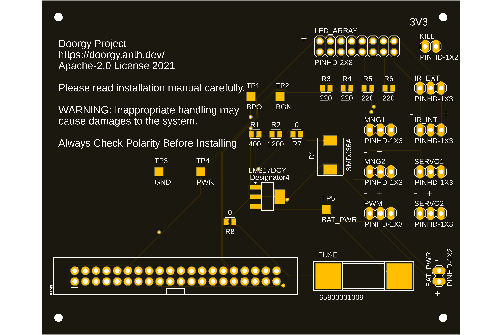
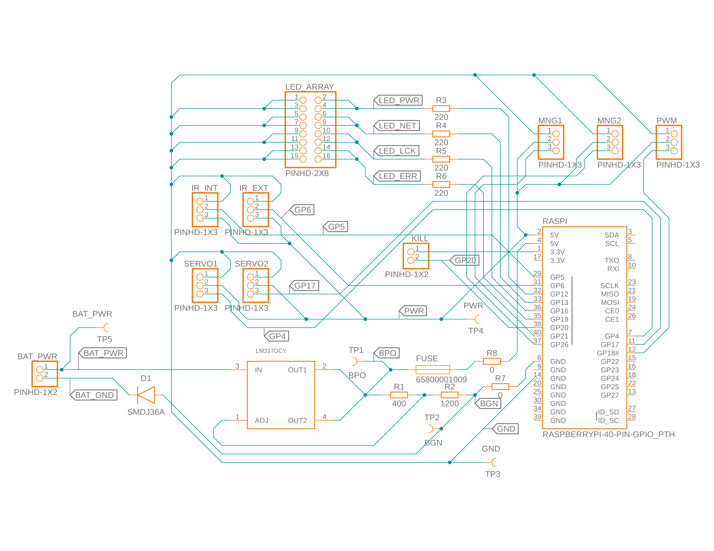
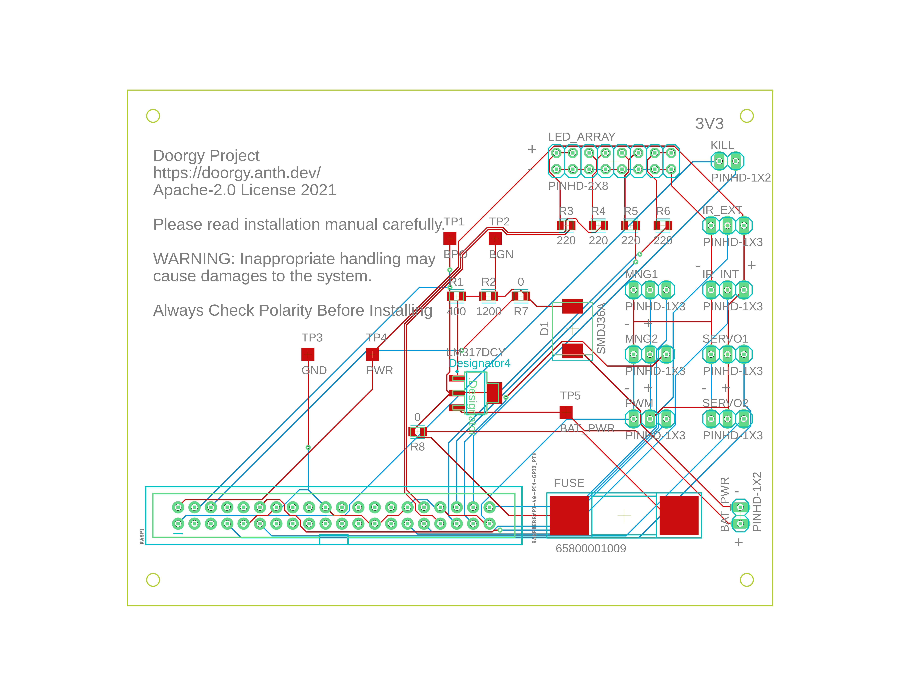

# Doorgy PCB

The Doorgy PCB integrates Raspberry Pi Zero WH with the Doorgy Frame and Hardwares.

Schematics, PCB Layout and Gerber Files are open source and freely available on this directory.

BOM and CPL used to construct Doorgy PCB on JLCPCB is also available on this directory.

- [Doorgy PCB](#doorgy-pcb)
  - [Gerber Files](#gerber-files)
  - [BOM](#bom)
  - [CPL](#cpl)
  - [PCB](#pcb)
  - [Schematic](#schematic)
  - [Layout](#layout)

## Gerber Files

Gerber files of the Doorgy PCB is located at [./Doorgy-PCB_2021-05-04-v32.zip](./Doorgy-PCB_2021-05-04-v32.zip)

## BOM

The BOM is currently only available in Microsoft Excel format and is located at [./Doorgy-PCB-BOM.xlsx](./Doorgy-PCB-BOM.xlsx)

## CPL

The CPL is currently only available in Microsoft Excel format and is located at [./Doorgy-PCB-CPL.xlsx](./Doorgy-PCB-CPL.xlsx)

## PCB

This is a illustration of a constructed Doorgy PCB Layout Version 32

## Schematic

This is the schematic of Doorgy PCB Schematic Version 22, note that resistor values have been changed to accomodate the parts available at JLCPCB.

## Layout

This is the routing layout of Doorgy PCB Layout Version 32.

