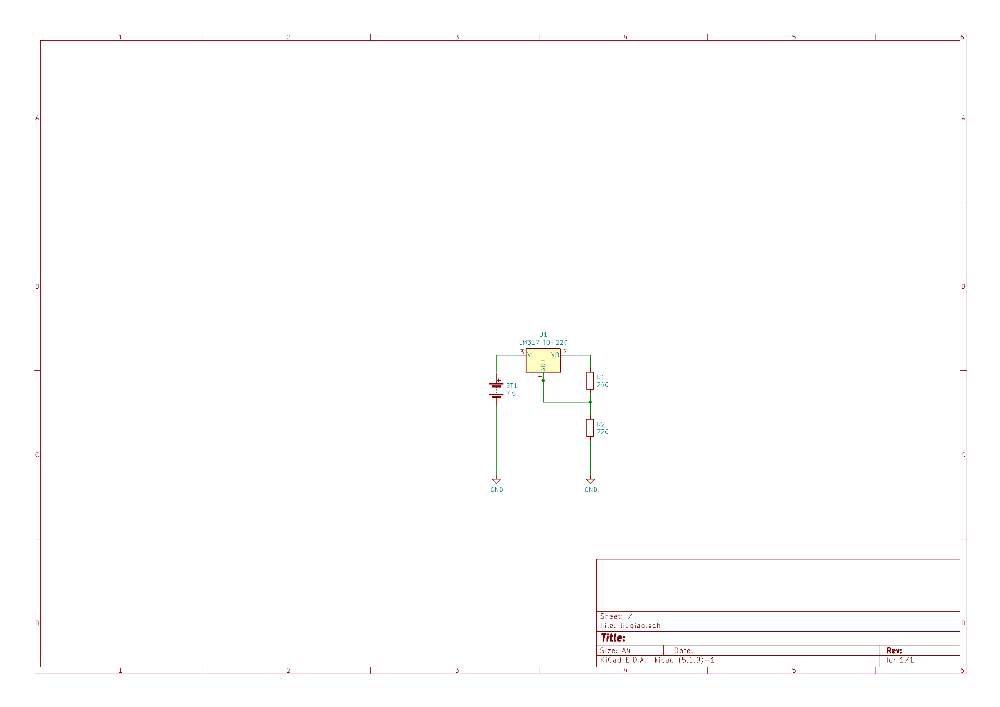

# Power Control Unit

This block is managed by Liuqiao Song

## Contents
- [Power Control Unit](#power-control-unit)
  - [Contents](#contents)
  - [Schematic](#schematic)
  - [Bill of Material](#bill-of-material)
  - [Additional](#additional)
    - [Voltage Monitoring](#voltage-monitoring)

## Schematic

## Bill of Material

| Quantity | Name              |
| -------- | ----------------- |
| 1        | LM317             |
| 1        | 240 ohm R         |
| 1        | 720 ohm R         |
| 1        | 5 pack AA battery |

## Additional

This section is added by Anthony Kung

### Voltage Monitoring

An INA 169 will be used to monitor voltage and provide battery statistics to the Raspi. AA battery operates at 1.5V and became inoperatable at around 1.2V.

[INA169 Datasheet](https://www.ti.com/lit/ds/symlink/ina169.pdf)